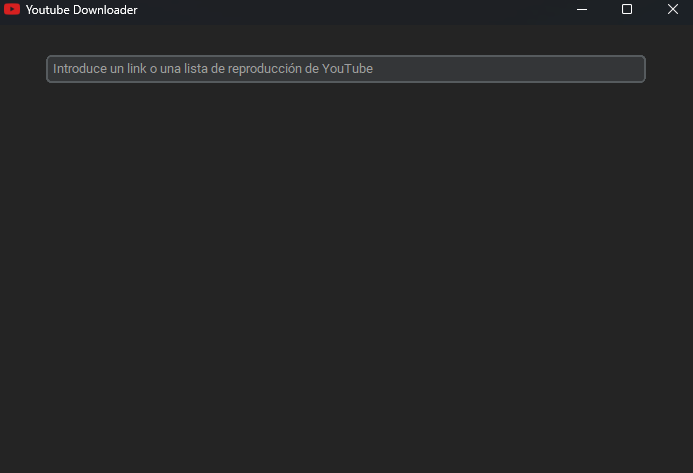
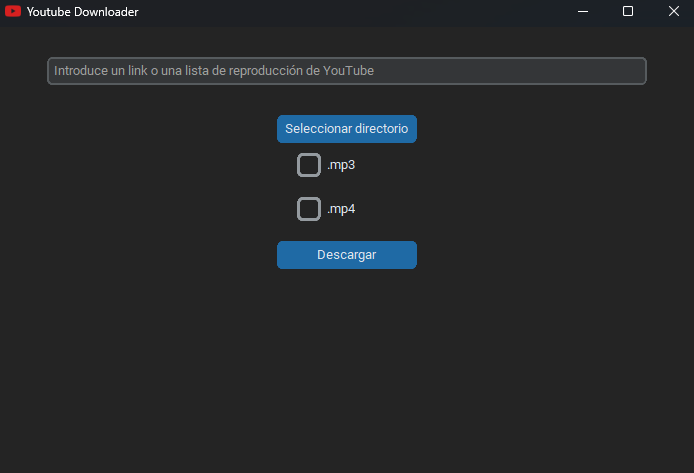

# Componentes de la interfaz

Ahora que tenemos nuestro `root` configurado, empezaremos a crear los componentes que formarán nuestra interfaz.

Pondremos todos estos componentes debajo de la configuración de `root`.

## Entrada de los links

Para crear la entrada donde introduciremos los links para descargar, crearemos una instancia de `ctk.CTkEntry` y renderizaremos con `.pack()`:

```python
link_entry = ctk.CTkEntry(root,
                           placeholder_text='Introduce un link o una lista de reproducción de YouTube',
                           width=600)
link_entry.pack(pady=30)
```

Los componentes necesitan una instancia en la que ser colocados. Eso será el primer parámetro: `root`.

En el caso de `link_entry`, además colocaremos un `placeholder_text`, que no es más que el texto predefinido que tendrá dentro.

También le daremos un ancho (`width`) de 600px, para que ocupe casi todo el espacio.

Por último, en el método pack le diremos que tenga un padding vertical (`pady`) de 30px para que no esté pegado a la parte superior de la ventana.

Puedes ver cómo va quedando ejecutando el archivo del programa.

Hasta ahora debería verse así:



## Etiqueta para los links

Crearemos una etiqueta para avisar de si hay algún error con los links:

```
link_label = ctk.CTkLabel(root, text='', text_color='red')
link_label.pack()
```

Le pondremos un `text_color` red.

## Botón de selección de directorio

Ahora crearemos un botón para seleccionar dónde queremos que se descarguen nuestros links.

Para ello, crearemos una instancia de `ctk.CTkButton`:

```python
output_button = ctk.CTkButton(root, text='Seleccionar directorio')
output_button.pack()
```

`text` es el texto que tendrá el botón.

## Etiqueta para directorio

También crearemos una etiqueta o label con una instancia de `ctk.CTkLabel`:

```python
output_label = ctk.CTkLabel(root, text='', text_color='cyan')
output_label.pack()
```

La dejaremos vacía, puesto que servirá para mostrar la ruta que hemos seleccionado para las descargas. Le pondremos un `text_color` cyan.

## Checkbox para .mp3 y .mp4

A continuación crearemos los checkbox para los formatos de salida del link con instancias de `ctk.CTkCheckBox`:

```python
mp3_checked = ctk.StringVar(value="off")
mp4_checked = ctk.StringVar(value="off")

mp3_checkbox = ctk.CTkCheckBox(
    master=root, text='.mp3', variable=mp3_checked,  onvalue='on', offvalue='off')
mp3_checkbox.pack(pady=10)

mp4_checkbox = ctk.CTkCheckBox(
    master=root, text='.mp4', variable=mp4_checked,  onvalue='on', offvalue='off')
mp4_checkbox.pack(pady=10)
```

`mp3_checked` y `mp4_checked` son variables que servirán para guardar el estado de los checkbox.

Los parámetros `onvalue` y `offvalue` son los valores que tendrá la variable que hayamos puesto en `variable`, en este caso `mp3_checked` y `mp4_checked`. El valor de las mismas cambiará en función de si el checkbox está chequeado o no.

## Botón de descarga

Después crearemos el botón de descarga:

```python
download_button = ctk.CTkButton(root, text='Descargar')
download_button.pack(pady=10)
```

## Etiqueta para la lista de reproducción

Crearemos una etiqueta para mostrar el título de la lista de reproducción que estamos descargando:

```python
playlist_label = ctk.CTkLabel(root, text='', wraplength=400, text_color='cyan')
playlist_label.pack()
```

El atributo `wraplength` sirve para indicar en qué punto queremos que el texto de la etiqueta salte a la siguiente línea, ocupando así menos espacio.

El atributo `text_color` es para cambiar el color del texto de la etiqueta. Nosotros lo pondremos color `cyan`, aunque puedes ponerlo del color que quieras. Es recomendable que sea de un color que facilite la legibilidad.

Puedes usar el nombre de un color o valores `hex` (#ff4335).

## Etiqueta para la descarga actual

También crearemos una etiqueta para mostrar el título del vídeo que estamos descargando, así como para indicar que la descarga ha terminado.

```python
complete_label = ctk.CTkLabel(root, text='', wraplength=400)
complete_label.pack()
```

## Etiqueta con el contador para la lista de reproducción

Crearemos una etiqueta para mostrar por qué video va la descarga y el total de vídeos de la lista de reproducción:

```python
count_label = ctk.CTkLabel(root, text='', text_color='cyan')
count_label.pack()
```

## Botón para mostrar las descargas

Por último crearemos un botón para abrir el directorio de descargas una vez hayan terminado:

```python
open_folder_button = ctk.CTkButton(root, text='Abrir descargas')
```

No haremos `.pack()` porque queremos mostrar el botón cuando hayan terminado las descargas.

Con esto ya hemos terminado de crear nuestra interfaz. Debería verse así:



Y nuestro código así:

```python
from pytube import YouTube, Playlist
import customtkinter as ctk
import re
import threading
import os


root = ctk.CTk()
root.title('Youtube Downloader')
root.geometry('700x450')
root.iconbitmap('youtube.ico')


link_entry = ctk.CTkEntry(root,
                          placeholder_text='Introduce un link o una lista de reproducción de YouTube',
                          width=600)
link_entry.pack(pady=30)

output_button = ctk.CTkButton(root, text='Seleccionar directorio')
output_button.pack()

output_label = ctk.CTkLabel(root, text='', text_color='cyan')
output_label.pack()

mp3_checked = ctk.StringVar(value="off")
mp4_checked = ctk.StringVar(value="off")

mp3_checkbox = ctk.CTkCheckBox(
    master=root, text='.mp3', variable=mp3_checked,  onvalue='on', offvalue='off')
mp3_checkbox.pack(pady=10)

mp4_checkbox = ctk.CTkCheckBox(
    master=root, text='.mp4', variable=mp4_checked,  onvalue='on', offvalue='off')
mp4_checkbox.pack(pady=10)

download_button = ctk.CTkButton(root, text='Descargar')
download_button.pack(pady=10)

playlist_label = ctk.CTkLabel(root, text='', wraplength=400, text_color='cyan')
playlist_label.pack()

complete_label = ctk.CTkLabel(root, text='', wraplength=400)
complete_label.pack()

count_label = ctk.CTkLabel(root, text='', text_color='cyan')
count_label.pack()

open_folder_button = ctk.CTkButton(root, text='Abrir descargas')

root.mainloop()

```

Ahora que ya tenemos nuestra interfaz terminada, [vayamos con la lógica de nuestro programa](../logica/utilidades.md).
