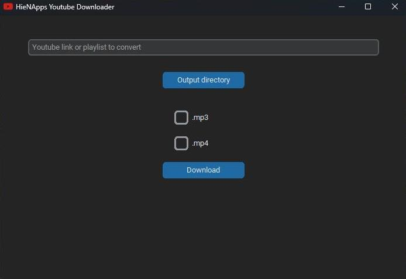

# Python Youtube Downloader

En este tutorial aprenderás a cómo crear tu propio programa en Python para descargar música y vídeos.

Podrás seguir este tutorial sin tener conocimientos sobre programación, pero será mucho más sencillo si conoces  los fundamentos o si ya has programado en Python.

En este tutorial se sobreentiende que ya tienes instalado [Python](https://www.python.org), si todavía no lo tienes puedes ver una guía [aquí](https://kinsta.com/es/base-de-conocimiento/instalar-python/#windows).

Puedes empezar el tutorial [aquí](primeros_pasos/empezando.md).
