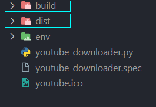

# Creando ejecutable con Pyinstaller

Vayamos ahora con la creación del ejecutable.

Abriremos una terminal e introduciremos el siguiente comando:

`pyinstaller --windowed --icon='youtube.ico' youtube_downloader.py`

Esto lanzará el proceso de crear el ejecutable.

Una vez finalice el proceso, verás que se han creado dos carpetas en el directorio de tu proyecto:

Dentro de `dist/youtube_downloader` veremos la carpeta `_internal` y `youtube_downloader.exe`. En esta carpeta deberemos añadir el icono de nuestra aplicación `youtube.ico`.

Una vez hecho esto podremos ejecutar `youtube_downloader.exe` y comprobar que funciona correctamente.

Podremos crear un acceso directo del ejecutable y ponerlo donde queramos.

Con esto finaliza el tutorial. ¡Espero que hayas disfrutado y aprendido mucho en el camino!
